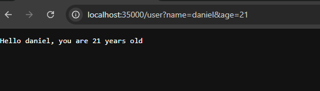
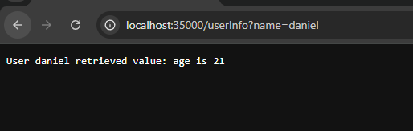

# MicroSpringBoot - Microframework Web con IoC y Reflexión Java

## Descripción del Proyecto

Este proyecto implementa un **servidor Web** en Java que proporciona un **framework IoC (Inversion of Control)** para la construcción de aplicaciones web a partir de POJOs (Plain Old Java Objects). 

El framework está diseñado para ser un prototipo mínimo, permitiendo la construcción de aplicaciones web declarativas mediante anotaciones personalizadas.

## Cómo Ejecutar el Proyecto

### Prerrequisitos
- **Java 17** o superior
- **Maven 3.6** o superior

### Pasos de Ejecución

#### 1. Compilar el Proyecto
```bash
mvn clean compile
```

#### 2. Ejecutar la Aplicación Principal
```bash
# (primera versión)
java -cp target/classes co.edu.escuelaing.microspringboot.MicroSpringBoot co.edu.escuelaing.microspringboot.HelloController

# (versión final)
java -cp target/classes co.edu.escuelaing.microspringboot.MicroSpringBoot
```

#### 3. Ejecutar las Pruebas
```bash
mvn test
```

## Estructura del Proyecto

```
AREP-MICROSPRINGBOOT/
├── src/
│   ├── main/
│   │   ├── java/co/edu/escuelaing/microspringboot/
│   │   │   ├── MicroSpringBoot.java          # Clase principal
│   │   │   ├── HttpServer.java               # Servidor HTTP principal
│   │   │   ├── ComponentScanner.java         # Escáner de componentes
│   │   │   ├── HttpRequest.java              # Manejo de requests HTTP
│   │   │   ├── HttpResponse.java             # Configuración de responses
│   │   │   ├── RestController.java           # Anotación @RestController
│   │   │   ├── GetMapping.java               # Anotación @GetMapping
│   │   │   ├── RequestParam.java             # Anotación @RequestParam
│   │   │   ├── Service.java                  # Interfaz para servicios
│   │   │   ├── HelloController.java          # Controlador ejercicio
│   │   │   ├── GreetingController.java       # Controlador ejercicio
│   │   │   └── WebApplication.java           # Aplicación web principal
│   │   │   └── ExampleController.java        # Controlador de ejemplo
│   │   └── resources/
│   │       └── webroot/                      # Archivos estáticos
│   │           ├── index.html                # Página principal
│   │           ├── style.css                 # Estilos CSS
│   │           ├── script.js                 # JavaScript
│   │           ├── serveis-watch.png         # Imagen PNG
│   │           └── time.jpg                  # Imagen JPG
│   └── test/
│       └── java/co/edu/escuelaing/microspringboot/
│           ├── HttpServerTest.java           # Pruebas del servidor HTTP
│           └── IntegrationControllerTest.java # Pruebas de integración
├── pom.xml                                   # Configuración de Maven

```

##  Ejemplos de Uso

### 1. Controlador Simple sin Parámetros
```java
@RestController
public class HelloController {
    @GetMapping("/hello")
    public static String index() {
        return "Greetings from Spring Boot!";
    }
}
```

### 2. Controlador con Parámetros de Consulta
```java
@RestController
public class GreetingController {
    @GetMapping("/greeting")
    public static String greeting(@RequestParam(value = "name", defaultValue = "World") String name) {
        return "Hola " + name;
    }
}
```

## Endpoints Disponibles

Una vez que el servidor esté ejecutándose en `http://localhost:35000`, puedes acceder a:

### Servicios REST
- `GET /hello` - Saludo simple
- `GET /greeting?name=TuNombre` - Saludo personalizado
- `GET /user?name=nombre&age=18` - Saludo y te devuleve la edad ingresada
-  `GET /userInfo` - Te devuelve la informacion de un usuario

## Resultados de ejecucion






### Archivos Estáticos
- `GET /` o `GET /index.html` - Página principal
- `GET /style.css` - Estilos CSS
- `GET /script.js` - JavaScript
- `GET /serveis-watch.png` - Imagen PNG
- `GET /time.jpg` - Imagen JPG

## Resultados de ejecucion


## Pruebas Implementadas

### Ejecutar Tests
```bash
# Ejecutar todos los tests
mvn test

# Ejecutar tests específicos
mvn test -Dtest=HttpServerTest
mvn test -Dtest=IntegrationControllerTest


```

1. HttpServerTest.java - Tests del Servidor HTTP Principal 

Propósito: Verificar que el servidor HTTP funcione correctamente en todos sus aspectos.

- testGetMethodRegistration - Verifica que se puedan registrar servicios REST
- testGetTypeWithHtmlFile - Comprueba que detecte correctamente tipos MIME (HTML = text/html)
- testGetTypeWithPngFile - Verifica detección de imágenes PNG
- testGreetingServiceWithValidName - Prueba el servicio de saludo con parámetros
- testLoadComponentWithRestController - Verifica que se carguen controladores automáticamente
- testInvokeServiceWithValidEndpoint - Prueba que se ejecuten los servicios correctamente
2. IntegrationControllerTest.java - Tests de Integración Completa
- Propósito: Verificar que todo el framework funcione end-to-end con controladores reales.
- testControllerLoading - Verifica que se carguen todos los endpoints del controlador
- testHelloEndpoint - Prueba endpoint simple sin parámetros
- testGreetingEndpointWithName - Prueba endpoint con parámetros de consulta
- testMathEndpointWithValidNumbers - Prueba endpoint con lógica de negocio
- testNonExistentEndpoint - Verifica que retorne 404 para rutas inexistentes


##  Tecnologías Utilizadas

- **Java 17** - Lenguaje de programación principal
- **Maven** - Gestión de dependencias y build
- **JUnit 5** - Framework de testing


## Autor

**Daniel Aldana** - [GitHub](https://github.com/Daniel-Aldana10)

